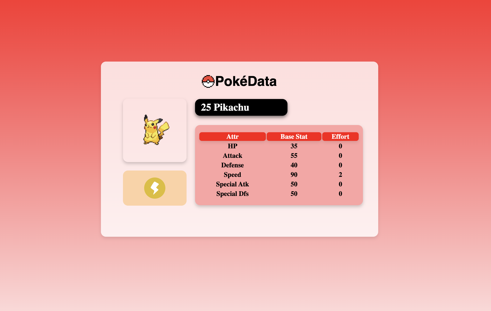
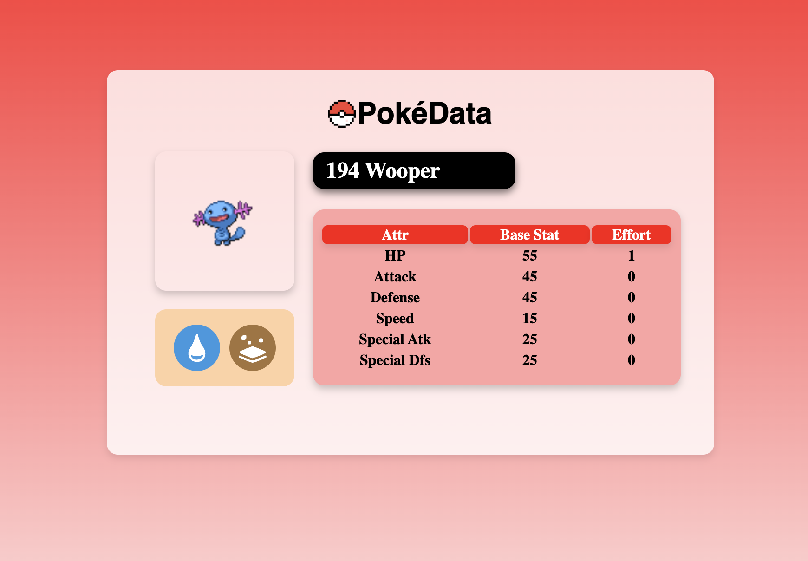

# 🐾 PokeSearch

A simple web application that demonstrates frontend–backend interaction using JavaScript and a public REST API.

---

## 📸 Screenshots

<p align="center">
  
  
  
</p>

---

## 🧠 Overview

PokeSearch is a beginner-friendly web application developed to explore how a frontend interacts with an external API using modern JavaScript techniques.

The project focuses on consuming API data using JavaScript’s `fetch()` method, processing structured responses, and dynamically rendering content on the webpage. API development was intentionally kept out of scope in order to focus on frontend logic and data handling.

This project was created as early preparation for my Integrative Programming course and to strengthen my foundation in modern web development fundamentals.

---

## 🚀 Features

- 🔍 Search Pokémon by name  
- 📊 Dynamic rendering of Pokémon information  
- 🎨 Conditional sprite rendering based on Pokémon type  
- 🧩 Support for multi-type Pokémon  
- 💡 Clean and minimal UI design using CSS  

The application determines which sprite image to display by evaluating the Pokémon’s type attributes returned by the API. Pokémon with multiple types are handled through conditional logic to ensure accurate visual representation.

---

## 🛠️ Built With

- **HTML** — Structure and layout  
- **CSS** — Styling and responsive design  
- **JavaScript** — API interaction, logic handling, and DOM manipulation  

This project was built using vanilla web technologies without external frameworks.

---

## 📥 Getting Started

### 1. Clone the repository

```sh
git clone https://github.com/PeelyMart/PokeSearch.git
```

### 2. Open the application

Open the `index.html` file in your browser.

---

## 🧪 How It Works

1. The user enters a Pokémon name in the search bar.  
2. JavaScript sends an HTTP request using `fetch()`.  
3. The API responds with Pokémon data in JSON format.  
4. The application processes the data and updates the UI dynamically.  
5. Pokémon type attributes are evaluated to determine which local sprite images should be displayed.

This workflow demonstrates practical usage of asynchronous JavaScript and conditional rendering.

---

## 🧠 What I Learned

- Using JavaScript’s `fetch()` for API interaction  
- Handling asynchronous operations and JSON data  
- Writing conditional logic for dynamic rendering  
- Improving layout structure and visual clarity with CSS  
- Understanding real-world frontend and backend communication  

---

## 📌 Possible Future Improvements

- Autocomplete suggestions while typing  
- Additional Pokémon data (abilities, moves, evolution chains)  
- Improved mobile responsiveness  
- Enhanced error handling for invalid searches  

---

## 🤖 AI Assistance Disclosure

This README file was written with the assistance of an AI language model (ChatGPT) to improve clarity, structure, and documentation quality.  
All project code, logic, and implementation were fully written and developed by the author.

---

## 📝 License

This project is open-source and available under the MIT License.
